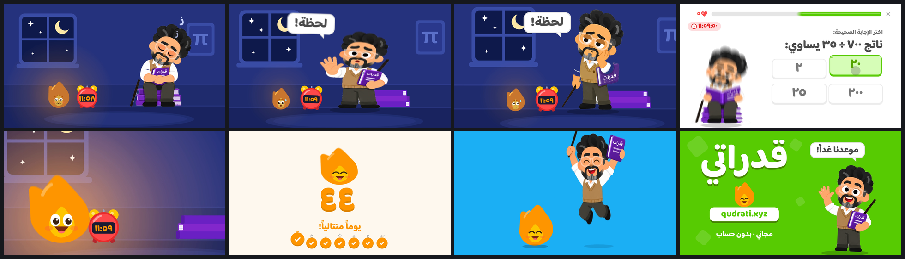

# قدراتي — «دقيقة قبل منتصف الليل»

*One minute to midnight.* The second Qudrati film is a 15-second **character** piece in the spirit of Duolingo's animation, where the first reel ([`../showreel`](../showreel)) was motion graphics. It tells the most Duolingo story there is: the streak is about to break.

**▶ [`qudrati-midnight.mp4`](qudrati-midnight.mp4)**: 1920×1080, 60 fps, H.264 + AAC, 15.000 s.



## The story

| Time | Beat | What happens |
|------|------|--------------|
| 0.00 | **١١:٥٨** | A night room: a crescent moon, a framed π, an alarm clock. قدّور has dozed off on his stack of books, snoring «ز ز ز». On the floor the streak flame is dying: brown, droopy-eyed, sweating, shrinking a size on each tick. |
| 1.88 | **١١:٥٩** | The clock flips on the downbeat. |
| 2.34 | **The alarm** | The bells hammer, the room shakes, the flame jolts awake. |
| 2.60 | **The take** | He squashes, then leaps off the books into `wait` mid-air (hand up, mouth open) and lands shaking. «لحظة!» |
| 3.05 | **The realisation** | `concerned`: hand to cheek, looking at the flame. The camera pushes in. «uh-oh» on the marimba. |
| 3.50 | **The dash** | He leans back, then smears off to the left in `cheer` (forward, in Arabic) and the camera whips after him. |
| 3.75 | **The lesson** | Three real questions from the bank, one per beat («كم قيمة √٤٩؟», «ناتج ٧٠٠ ÷ ٣٥ يساوي:», «كم ثانية في ٣ دقائق؟»). The seconds race from ١١:٥٩:٤٠ to :٥٨. The app's correct chime climbs a whole tone per answer, like a combo, and he bounces on his books with each one. |
| 5.63 | **«أحسنت!»** | The bar fills, the praise slams, he leaps off the books in `celebrate`. |
| 6.10 | **The flame** | Back in the room, close on the flame. It squeezes its eyes shut and gathers itself down (a rising inhale)… |
| 6.56 | **FWOOSH** | …and roars back on the beat: tall, bright, grinning. The room warms from indigo to amber. |
| 7.15 | **The flare** | The flame swells until it fills the frame, and we come out the other side of it. |
| 7.50 | **٤٤** | The streak screen. ٤٣ rolls to **٤٤** on beat 1, the week fills in right to left, and today, Friday «ج», gets its tick on beat 2. |
| 9.38 | **The duet** | قدّور leaps in as a blue wave sweeps the screen. Call and response on the beat: the flame front-flips, he jumps in `celebrate`, then both jump together, over a tin-whistle hook. |
| 11.25 | **«لا تكسر السلسلة!»** | Stop-time: three words, three hits, each landing with weight. قدّور in `proud` nods along with his arms crossed, and the flame arcs in to land on the last word, which squashes under it. «درس قصير كل يوم». |
| 13.13 | **«موعدنا غداً!»** | A green wave rises. He jumps up waving, the wordmark extrudes, and the flame hops onto the qudrati.xyz button. It presses it on the final hit (F major), the same gesture as the first film's ending. |

## How it's animated

- **Pose-to-pose, like Duolingo.** قدّور has 14 painted poses on the app's three character sheets. The film acts with eight of them (sleep, wait, concerned, read, cheer, celebrate, proud, wave) and swaps them *inside* the squash or the stretch of a move, so each new drawing arrives hidden in the smear. Every move runs anticipation → stretch → hang → squash → settle over a live shadow that shrinks in the air, the grammar the app's own mascot notes ask for.
- **The flame is a rigged character.** It's built in SVG from the app's own streak icon: two eyes with pupils that look around, a blink, worried brows, a sweat drop, and five mouths (frown, wavy, O, smile, grin). Its fire is a seeded flicker, so every render is identical. It acts: it dies, it pleads, it roars, it flips, and it presses a button.
- **Nothing behind the characters.** No confetti, rings or particle sprays (the rule in the app's CLAUDE.md). The celebrations are the characters themselves. The one colour flood sweeps in from the corner as a wave instead of framing him.
- **Continuity.** The books painted under the sitting poses are redrawn in SVG behind them, so when he leaps off, the stack stays where it was, still in the room when we come back to it.
- **Right to left.** Every exit goes right and every entrance comes from the left. Arabic text rises by word from behind masks, never by letter.

## Files

| File | Role |
|------|------|
| `index.html` | The stage: the room, the clock, the lesson UI, the streak screen, the tagline and the end card, all in HTML/CSS/SVG. Serve the folder statically to preview with play/scrub and synced audio. |
| `film.js` | One paused GSAP timeline, plus the two rigs: `rig()` for قدّور (pos › lean › squash › one image per pose) and `flame()` for the streak flame. |
| `soundtrack.py` | Score and sound design, synthesized in numpy/scipy on the same grid: music box, Karplus–Strong plucked bass and chords, snores with a whistle, the alarm hammer, a fire ignition with crackle, boings, slide whistles and a tin-whistle hook. The only sample is the app's `correct.mp3`. |
| `render.mjs` | The same renderer as the first film: 8 sub-frames per frame across a 180° shutter for real motion blur, 4 Chromium workers, BT.709 H.264. |
| `tools/cut_poses.py` | Cuts the poses from the Qudrati sheets with the app's own `slice_mascot.py` at 2× size, keys out the painted floor ellipses (the film draws live shadows) and removes background trapped inside the silhouette. |

```bash
QUDRATI=/path/to/-QUDRATI python3 tools/cut_poses.py   # poses → assets/mascot/
python3 soundtrack.py                                  # → soundtrack.wav
node render.mjs video                                  # → qudrati-midnight.mp4  (SAMPLES=1 for a draft)
```

Poses and art are from the Qudrati repository (MIT). Baloo Bhaijaan 2 is under the SIL Open Font License. GSAP is under its standard no-charge license.
