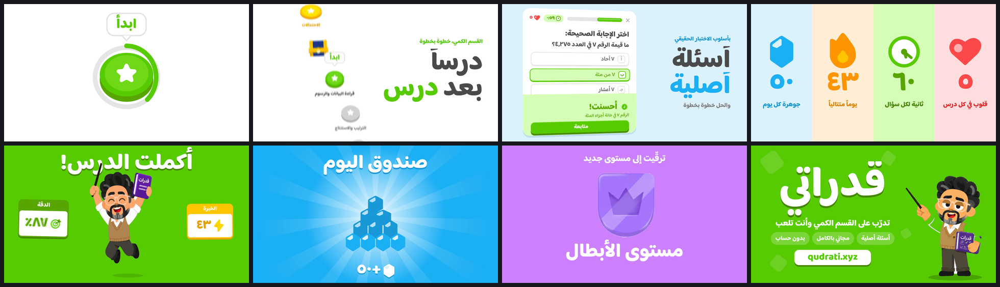

# قدراتي — 15-second showreel

A 15-second motion piece for [qudrati.xyz](https://qudrati.xyz/), the free Duolingo-style game for practising the quantitative section of the Saudi GAT (Qiyas). It's built entirely from the app's own material: its palette, its font, its lesson nodes, its chest, its rank badges and its mascot قدّور.

**▶ [`qudrati-showreel.mp4`](qudrati-showreel.mp4)**: 1920×1080, 60 fps, H.264 + AAC, 15.000 s.



## The cut

128 BPM, eight bars, **one shot per bar** (1.875 s). Every cut, hit and hop sits on the grid.

| # | Time | Shot | What happens |
|---|------|------|--------------|
| 1 | 0.00 | **ابدأ** | The start node grows out of the page, the progress ring draws, the «ابدأ» tooltip lands on beat 1. On beat 2 the face drops onto its lip (the app's own `:active` press), and the camera dives into the star. Its white becomes the next shot. |
| 2 | 1.88 | **درساً بعد درس** | The unit-1 path: nodes pop up on sixteenths, then lessons turn gold one per eighth note while the page scrolls. Each one rings a marimba note up the C-major pentatonic. The chest on the path wiggles as you pass it. |
| 3 | 3.75 | **أسئلة أصلية** | A real question from the app, «ما قيمة الرقم ٧ في العدد ٤٫٢٧٥؟», with a live 60-second clock. Tap «ب» on beat 1, press «تحقق» on beat 2; the answer goes green and jumps, the app's correct-answer chime plays, and «أحسنت!» slides up. |
| 4 | 5.63 | **The systems** | Four strips drop in right-to-left like a drum fill: ٥ hearts, ٦٠ seconds, a ٤٣-day streak, ٥٠ gems. Each icon keeps its own life (a heartbeat on the kick, spinning hands, a flickering flame, a gem flip). |
| 5 | 7.50 | **أكملت الدرس!** | The strips lift like a curtain as Qaddour falls through, stretched, and lands hard on the downbeat. He hops on beats 2 and 3: anticipation, stretch, hang, squash, settle, over a shadow that shrinks in the air. **No confetti, no rings, no particle sprays: the character is the celebration** (the rule in the app's CLAUDE.md). |
| 6 | 9.38 | **صندوق اليوم** | A bottom sheet rises. The navy chest hops with the app's frame-measured `CV_TAP_HOP` choreography, opens on beat 1, light pours out, a white wash, and the 4-3-2-1 gem pyramid lands gem by gem while the counter ticks to +٥٠. |
| 7 | 11.25 | **مستوى الأبطال** | Rank-up: bronze → silver → gold → diamond roll past like a slot reel, and champion lands on beat 2 with purple flooding out of it, scored with the app's own `sndRankUp` fanfare notes. |
| 8 | 13.13 | **قدراتي** | Qaddour jumps into frame and points. The wordmark rises out of the page (mask reveal, then its 3D lip extrudes), with the tagline, the site's three landing badges, and the URL as a real Duolingo button. The button gets pressed on the final hit, the same gesture that opened the film. |

## Decisions worth knowing

- **Forward is leftward.** Arabic reads right to left, so every "next" motion enters from the left and exits right: the whip out of the path, the question card sliding in, the strips cascading, the rank reel. Headlines sit on the right, where the eye starts.
- **Arabic is revealed by word, never by letter.** Splitting cursive script into letters breaks the joins, so text rises from behind per-word masks. The masks travel far enough that hamzas, maddas and tanween never peek out early.
- **Nothing is invented.** Colors are the app's Figma-exact tokens, the font is Baloo Bhaijaan 2, the nodes are the 71×58 face on a 7 px lip, the chest is `chestArt()` ported verbatim, the question and lesson titles come from the question bank, and the heart count (٥), clock (٦٠ s) and chest reward (٥٠) are the constants in `app.js`.
- **Qaddour only appears in poses the app ships, used as the app uses them**: `celebrate` for the win, `point` for "here's what you get" on the end card. The end-card copy has its baked-in floor ellipse keyed out (`qaddour-point-nofloor.png`) so it sits on green.
- **The melody is the sound design.** Path nodes, the strip icons, the gem pile, the rank ticks and the end-card pills are each pitched on the chord underneath them (F | C G Am F | G C | F→C), so the SFX *are* the tune over a sidechained house groove.

## How it's made

| File | Role |
|------|------|
| `index.html` | The 1920×1080 stage: all eight shots in HTML/CSS/SVG. Open it through any static server to preview; it has a play/scrub bar and plays `soundtrack.wav` in sync. |
| `showreel.js` | One paused GSAP master timeline. Everything is a pure function of time, so any sub-frame renders identically every run. |
| `render.mjs` | Headless Chromium renders each output frame as the average of **8 sub-frames across a 180° shutter** (real motion blur, not a filter), across 4 parallel workers. ffmpeg's `tmix` does the accumulation, and the result is graded to BT.709 and muxed with the audio. |
| `soundtrack.py` | The whole score and more than a hundred sound-design events, synthesized in numpy/scipy at 48 kHz from the same grid and cue times as the timeline. The only sample is the app's own `correct.mp3`. |

### Rebuild

```bash
# audio (numpy, scipy; ffmpeg on PATH or FFMPEG=/path/to/ffmpeg)
python3 soundtrack.py

# video (Playwright + Chromium; ffmpeg with libx264)
npm i -D playwright            # or point NODE_PATH at a global install
node render.mjs video          # → qudrati-showreel.mp4   (SAMPLES=1 for a fast draft)
node render.mjs stills 4.7 8.2 # → frames/still-*.png, for checking single moments
```

Assets are from the Qudrati repository (MIT). Baloo Bhaijaan 2 is under the SIL Open Font License (`assets/fonts/OFL.txt`). GSAP is under its standard no-charge license.
